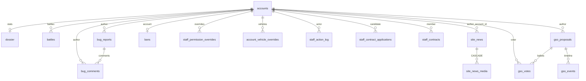

---
tags:
  - architecture
  - db
---

# Database schema

The database is `wot_emulator` (default name), MySQL/InnoDB, `utf8mb4_unicode_ci`.

> [!warning] There are no migrations
> The schema is created **on every request** from code: `ensure_site_schema()` in `db.php`
> and `ensure_staff_schema()` in `includes/staff.php`. No `.sql` files, no versioning.
> Adding a table or column means editing that code.

## How to add something

Tables are plain `CREATE TABLE IF NOT EXISTS`. Columns **must** be guarded, because
`ALTER TABLE ADD COLUMN` fails the second time:

```php
if (db_column_exists($pdo, 'accounts', 'id') && !db_column_exists($pdo, 'accounts', 'new_column')) {
    $pdo->exec("ALTER TABLE accounts ADD COLUMN new_column ... AFTER something");
}
```

The `accounts.id` check isn't redundant: it guarantees the emulator has already created its
table, so we're not altering something that doesn't exist yet.

## Whose tables are whose

### The emulator's — the site reads and carefully extends

| Table | Role |
|---|---|
| `accounts` | player accounts; the site **adds** its own columns (below) |
| `dossier` | player stats; the site creates a row at registration |
| `battles` | battles; the site only counts them for the homepage |
| `vehicle_modules` | each player's tanks and the modules installed on them; the site does **not** touch it → [[Vehicle modules and the two id spaces]] |

Columns the site adds to `accounts`: `is_admin`, `staff_role`, `is_banned_reports`, `email`
(plus a unique key), `is_verified`, `reg_ip`, `last_ip`.

> `reg_ip` is the IP of the last **website** login. `last_ip` is the IP of the last **game**
> login, written by the game server. IP bans use both.

### The site's

| Table | About |
|---|---|
| `site_news`, `site_news_media` | posts and media → [[News]] |
| `site_updates` | editable release history and patch notes |
| `site_settings` | key-value settings → [[Downloads and mirrors]] |
| `bug_reports`, `bug_comments` | bug tracker → [[Bug tracker]] |
| `bans` | blocking → [[Bans]] |
| `email_codes` | one-time codes → [[Email and codes]] |
| `auth_attempts` | failed login/registration counter per scope + IP → [[Security]] |
| `disabled_vehicles`, `account_vehicle_overrides`, `vehicle_access_events` | vehicles → [[Vehicle access]] |
| `staff_permission_overrides`, `staff_action_log` | RBAC and audit → [[Roles and permissions]] |
| `staff_contract_applications`, `staff_contracts` | initial/renewal applications, fifth-day renewal, linked seven-day terms, termination data, and public PDF → [[Team contracts]] |
| `gso_proposals`, `gso_votes`, `gso_events` | multi-round council workflow, round-scoped ballots, one-time head rejection, and timeline → [[GSO]] |

> [!important] There are **two** game servers on this database now
> The original 0.6.5 emulator (`server_core/emulator_impl.py`) and a newer from-scratch
> 0.8.2 server (the `wot_082` repo, Python 3 + asyncio). They share `wot_emulator` but
> were written independently, so "the game server does X" is no longer a single claim —
> ask *which one*. The 0.8.2 server currently touches exactly two tables: `accounts`
> (read) and `vehicle_modules` (read + write). Notably it does **not** read `bans` or the
> vehicle-access tables → [[Vehicle access]].

## The shared contract: `bans`

This table is read by the **0.6.5 game server** (`server_core/emulator_impl.py`) to keep
banned players out of the game. Its structure is a contract between two projects and can't
be changed unilaterally.

```
bans(id, ban_type ENUM('account','ip','mac'), account_id, ip, mac,
     reason, created_by, created_at)
```

One row is one rule. Unique keys on `account_id`, `ip` and `mac` prevent duplicates.

## Relationships



The only real `FOREIGN KEY` in the schema is `site_news_media.news_id → site_news.id` with
`ON DELETE CASCADE`. Everything else is enforced at the application level, because the
emulator's tables can't be decorated with constraints.

## Data that lives outside the database

- **`_vehicles.json`** (~800 KB) — the vehicle catalog. It's the source of truth for names
  and tiers; the database only stores **access rules**. See [[Vehicle access]].
- **`includes/roadmap_data.php`** — roadmap content, bilingual, also in code.

Related: [[Request lifecycle]], [[System overview]]
