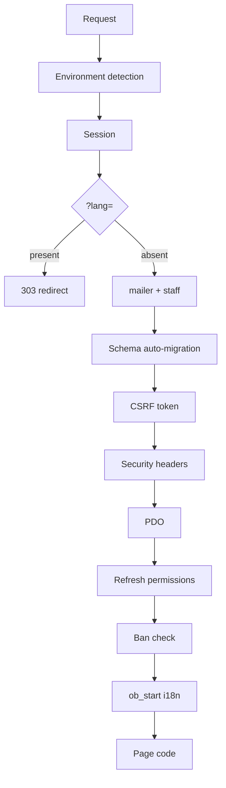

---
tags:
  - architecture
  - db
---

# Request lifecycle

> [!important] The main thing
> `db.php` is **not a database connection file**. It is the application bootstrap.
> If you're looking for "where X gets initialized" — it's almost certainly here.

Every page starts with `require_once 'db.php'`. By the time the page's own first line runs,
everything below has already happened, in exactly this order.

## The sequence

**1. Environment detection.** `orion_is_https()` and `orion_is_local()` decide whether this is
production. They drive the session cookie's `secure` flag, HSTS, and error display.
See [[Configuration and secrets]].

**2. Error mode.** Locally `display_errors` is on; elsewhere it's off (stack traces expose paths,
SQL, and connection parameters). `log_errors` is always on.

**3. Session.** `session_set_cookie_params()` with `httponly`, `samesite=Lax`, and `secure`
matching the detected protocol, then `session_start()`.

**4. Language switch.** If `?lang=ru|uk` is present, the value goes into `$_SESSION['lang']`
and the request **303-redirects to the same URL without the parameter**, so `lang=` doesn't
stick to links. Default is `ru`.

**5. `mailer.php` and `includes/staff.php` are loaded.**

**6. Schema auto-migration.** `ensure_site_schema($pdo)` runs `CREATE TABLE IF NOT EXISTS` and
conditional `ALTER TABLE` **on every request**. There are no migration files. A static `$ready`
flag keeps it to once per request. Details: [[Database schema]].

**7. CSRF token.** Generated as `bin2hex(random_bytes(32))` if the session doesn't have one.

**8. Security headers.** `security_headers()`: `X-Frame-Options`, `X-Content-Type-Options`,
`Referrer-Policy`, `Permissions-Policy`, CSP, and HSTS on HTTPS. See [[Security]].

**9. Database connection.** Config from `server.json` (not in the repo — see
[[Configuration and secrets]]), otherwise defaults. PDO with `ERRMODE_EXCEPTION`,
`FETCH_ASSOC`, `EMULATE_PREPARES => false`.

**10. Permission refresh.** `refresh_session_staff_access($pdo)` re-reads role and permissions
from the database into the session on **every** request, so role changes take effect immediately.
See [[Roles and permissions]].

**11. Ban enforcement.** `enforce_session_ban($pdo)` checks for a ban by account **or** current IP
and destroys the session. Works on any page. Staff are exempt. See [[Bans]].

**12. Translation buffer.** `ob_start('i18n_output_filter')` — the last line of the file.
Everything the page outputs from here on passes through the filter. See [[Localization]].

## What follows from this

- **A new table or column** means editing `ensure_site_schema()` in `db.php` (or
  `ensure_staff_schema()` in `includes/staff.php`), guarded by `db_column_exists()`.
- **A page can't "not have"** a session, CSRF token, or ban check — they're already there.
- **Never output anything before `require_once 'db.php'`** — redirects and headers come after it.
- Non-HTML responses (admin JSON, file downloads) pass through the translation filter untouched;
  it inspects `Content-Type` via `headers_list()`.

## Useful functions from `db.php`

| Function | Purpose |
|---|---|
| `get_setting` / `set_setting` | key-value access to `site_settings` |
| `get_setting_json` | same, with `json_decode` |
| `verify_csrf($token)` | token check on public pages |
| `get_client_ip()` | honors `CF-Connecting-IP` and `X-Forwarded-For` |
| `find_active_ban($pdo, $id, $ip)` | ban reason or `null` |
| `is_disposable_email($email)` | disposable-domain blocklist, subdomain-aware |
| `seo_head(...)` | one block of meta, OG and Twitter Card tags |
| `should_show_session_popup()` | donation modal: once per session, then every 30 min |
| `orion_is_https()` / `orion_is_local()` | environment detection |

One-time code functions (`create_email_code`, `check_email_code`, …) are covered in
[[Email and codes]].
