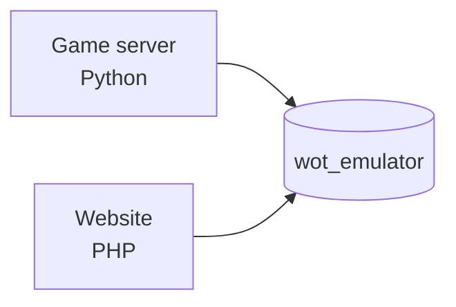

---
tags:
  - architecture
---

# System overview

## What this is

A classic server-rendered PHP site. Every `.php` file in the root is a route.
There is no framework, no router, no build step, no `composer.json`, no `package.json`.
A file on disk is a URL.

This isn't technical debt — it's deliberate. The site lives next to the game server on the
same host and has to be deployable by copying files.

## Repository map

```
/                    routes (index, download, bugs, login, admin, …)
  db.php             bootstrap — required by EVERY page
  lang.php           RU→UK phrase map and translation filter
  mailer.php         mail delivery (SMTP or mail())
  recaptcha.php      reCAPTCHA v2 verification
  style.css          public design system
  admin.css          admin design system
  _vehicles.json     vehicle catalog (~800 KB), source for the "vehicles" tab
/includes            shared pieces that aren't routes
  header.php         the whole <head> plus the site header
  footer.php         footer plus script loading
  staff.php          RBAC: permission catalog, roles, audit
  roadmap_data.php   bilingual roadmap content
  donate_modal.php   donation dialog
/js                  theme.js (in <head>), site.js (public), admin.js (admin)
/tests               four suites — see [[Tests]]
/fonts               e-Ukraine, self-hosted
/images /video       static assets
/uploads/news        news media uploaded from the admin panel
/patch               Linux client install scripts, served through get.php
/_template           design PROTOTYPE, not used by the site
/docs/superpowers    redesign spec and plan (historical artifact)
/obsidian            this vault
```

## Three layers

**1. Bootstrap.** [[Request lifecycle]] — `db.php` does everything shared: session, language,
schema, CSRF, security headers, DB connection, permissions, bans, translation buffer.

**2. Shared shell.** `includes/header.php` + `includes/footer.php` render the entire document.
A page just sets a few variables before requiring the header, then writes its own `<main>`.

**3. Page.** Page logic and markup live in one file. Queries at the top, HTML at the bottom.

## The key dependency: a shared database

The `wot_emulator` database belongs to the **game server**, not the site. The site connects
to it as a second client.



`accounts`, `dossier` and `battles` are created and maintained by the emulator.
`site_news`, `bans`, `bug_reports`, `site_settings` and others are created by the site
(see [[Database schema]]).

Consequences worth keeping in mind:

- **Passwords** are stored as unsalted `sha256` — that's how the game server verifies them.
  Changing this requires changing the emulator in lockstep. See [[Authentication]].
- **`bans`** is read by the game server, so its shape is a cross-project contract. See [[Bans]].
- The schema can't be reshaped to suit the site: the site only **adds** its own tables and columns.

## Where to go next

- How the admin panel works → [[Admin panel]]
- How translation works → [[Localization]]
- How the frontend is put together → [[Design system]]
- Who can do what → [[Roles and permissions]]
