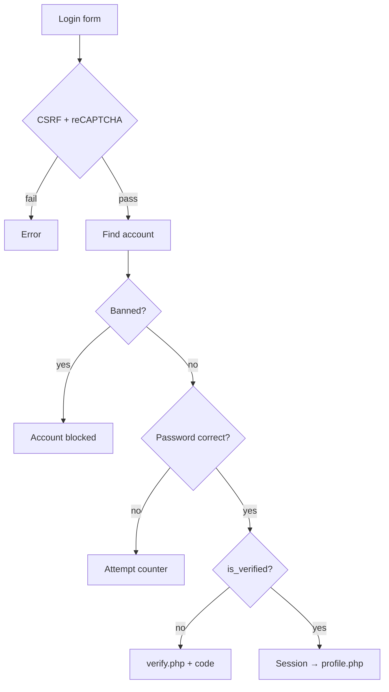

---
tags:
  - domain
  - security
---

# Authentication

Files: `register.php`, `login.php`, `verify.php`, `reset_password.php`, `logout.php`, `profile.php`,
`discord.php`, `includes/discord_oauth.php`.

> [!danger] Passwords are unsalted SHA-256
> ```php
> $password_hash = hash('sha256', $password);
> ```
> This is **not a bug or an oversight**. It's how the game server verifies passwords during
> BigWorld login, and the `accounts.password_hash` column is shared. Moving to
> `password_hash()` / bcrypt is possible **only in lockstep with the emulator**.
> Changing it unilaterally breaks game login for every player.
>
> Keep it in mind as a known trade-off: [[Security]].

## Registration

`register.php`, in order:

1. CSRF
2. reCAPTCHA v2 (`verify_recaptcha`)
3. username / email / password validation
4. `is_disposable_email()` — blocklist from `disposable_email_domains.php`, subdomain-aware
   (`a.b.mailinator.com` is blocked by `mailinator.com`)
5. **one account per IP** — checked against `reg_ip`
6. username and email uniqueness

Then, in **a single transaction**: `INSERT INTO accounts` plus `INSERT INTO dossier (account_id)`.
The `dossier` row is mandatory — without it the game server won't see the player.

`is_verified` depends on `EMAIL_VERIFICATION_ENABLED`: with confirmation disabled the account is
active immediately.

Registration attempt counters live in the session.

## Discord OAuth

`discord.php` supports three modes:

1. `connect` — an authenticated account links one Discord ID.
2. `login` — a linked Discord ID authenticates the existing account; an unknown ID continues to
   the normal registration form.
3. `register` — an unknown Discord ID is held in the session while the user supplies the game
   username, email, password, and CAPTCHA.

The registration transaction creates `accounts`, `dossier`, and `account_discord_links` together.
Linked accounts store encrypted OAuth access and refresh tokens. `profile.php` uses the refresh
token when needed and checks `/users/@me` to keep the stored Discord `username` current. Legacy
links without tokens silently attempt one reauthorization; if Discord authorization was revoked,
the user must authorize the application again.

## Login

`login.php` — branch order matters:

1. CSRF and reCAPTCHA
2. lookup by `username` **or** `normalized_name` **or** `email`
3. **`find_active_ban()` runs before the password check.** A banned user sees "account blocked",
   not "wrong password"
4. if the password is correct but `is_verified = 0` and confirmation is enabled, a fresh code is
   sent and the user is redirected to `verify.php`
5. success → `session_regenerate_id(true)`, session populated,
   `refresh_session_staff_access()`, a persistent login token is issued, `last_login` and
   `reg_ip` updated, redirect to `profile.php`
6. failure → attempt counter in the session



## Email confirmation and password reset

Both flows use one-time codes from `email_codes` — details in [[Email and codes]].

- `verify.php` — registration confirmation (`purpose = 'register'`)
- `reset_password.php` — password reset (`purpose = 'reset'`)

## Global ban enforcement

Separate from login: `enforce_session_ban()` in `db.php` checks for a ban **on every page** and
destroys the session if the account **or** the current IP is banned. Staff (`session_is_staff()`)
are exempt. So a banned player can't use the site even if they were logged in before the ban.
See [[Bans]].

## What's in the session

| Key | Value |
|---|---|
| `user_id`, `username` | the account |
| `is_admin` | legacy flag |
| `staff_role`, `staff_role_label`, `staff_permissions` | RBAC, refreshed every request |
| `lang` | `ru` / `uk` |
| `csrf_token` | 32 bytes hex |
| `popup_last_shown` | donation modal throttle |
| `pending_verify_email` | intermediate confirmation state |
| `discord_registration` | short-lived Discord identity and registration OAuth tokens |

## Persistent login

A successful login creates a 30-day `orion_remember` cookie. The cookie contains a random
128-bit selector and 256-bit validator; `account_remember_tokens` stores only the selector
and the validator's SHA-256 hash. The cookie is `HttpOnly`, `SameSite=Lax`, and `Secure` on
HTTPS.

When the browser-session cookie is gone, `db.php` consumes the remember token, regenerates
the PHP session ID, restores the account, and immediately rotates the token. An active login
also rotates during the final seven days, making the 30-day window rolling. Logout revokes the
current token. A ban or any password change revokes the affected account's remembered sessions.
Invalid, expired, or unverified-account tokens are deleted instead of restoring a session.

Related: [[Roles and permissions]], [[Email and codes]], [[Security]]
