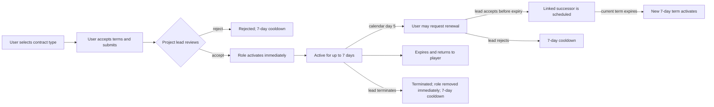

---
tags:
  - domain
  - contracts
  - staff
---

# Team contracts

Files: `contracts.php`, `contract_pdf.php`, `includes/contracts.php`,
`includes/contract_pdf.php`, and the `contracts` tab in `admin.php`.

## Lifecycle

The user chooses one of five contract types: `orion_council_head`, `developer`,
`senior_moderator`, `moderator`, or `content_maker`. The submission stores the selected type, optional
comment, terms acceptance, public-registry consent, timestamp, and IP.

Only the normalized `admin` role at rank 100 (the project lead/creator) can accept
or reject a pending contract. Acceptance does not create another offer or ask the
user for a second signature. It immediately:

- creates the public contract record;
- assigns the selected staff role;
- clears per-account permission overrides;
- sets `starts_at` to the decision time;
- sets `expires_at` to exactly seven days later.

The start day counts as calendar day one. At the same Kyiv wall-clock time four
calendar dates later (the start of the fifth contract day), the user may submit one
renewal application for the same role. The application references its parent contract
and requires fresh terms acceptance and public-registry consent.

If the lead accepts while the parent is active, a linked successor is scheduled to
start exactly when the parent expires. If review happens after expiry, the successor
starts at the decision time. Either way it receives a new number, public record, PDF,
seven-day term, and its own fifth-day renewal window. Rejection does not extend the
current term.

The project lead can terminate an active contract or cancel a scheduled successor.
The administration undertakes not to terminate a contract without a justified, recorded
reason. Termination immediately restores the effective role, rejects any pending renewal,
cancels a linked scheduled successor, and publishes the reason plus termination date and time.
After either a rejection or a termination by the project lead, the account cannot submit an
initial or renewal contract for seven days. The server derives this cooldown from the latest
recorded lead action, enforces it on submission, and exposes the exact Kyiv-time end to the user.

## Role synchronization

`synchronize_contract_lifecycle()` runs before the staff session is refreshed on
every request. It expires finished contracts, restores `player`, and reasserts the
effective role while a contract is active. Admin role/permission edits and account
or IP ban flows reject targets with active contracts, preventing legacy controls
from bypassing the seven-day term.

Legacy database columns and historical statuses remain readable so PDFs created by
the previous workflow do not break. New records use `active`, `scheduled`, `expired`,
and `terminated`.

## Public PDFs

`contracts.php` groups every accepted contract into a separate list for its staff role and
shows any recorded termination reason, date, and time. All public page times are displayed in `Europe/Kyiv`; stored
timestamps remain UTC.
`contract_pdf.php` accepts the opaque
24-character `public_id` and generates an A4 PDF in `uk`, `ru`, or `en`. The document
records the user submission, project-lead acceptance, selected role, exact start,
exact expiry, renewal rules, Kyiv-time labels, and decision verification code.

The PDF generator has no Composer dependency. It parses the local e-Ukraine OpenType
fonts, embeds their CFF outlines, adds a Unicode map, and creates two-page PDFs.
Binary output explicitly bypasses the site's HTML translation output buffer.

## Tables

- `staff_contract_applications` — initial or renewal request, optional comment,
  consent, parent contract reference, review decision, and timestamps.
- `staff_contracts` — accepted role, public ID, seven-day term, parent/successor
  relation, renewal availability, approver, termination data, and verification data.

Related: [[Roles and permissions]], [[Database schema]], [[Request lifecycle]]
