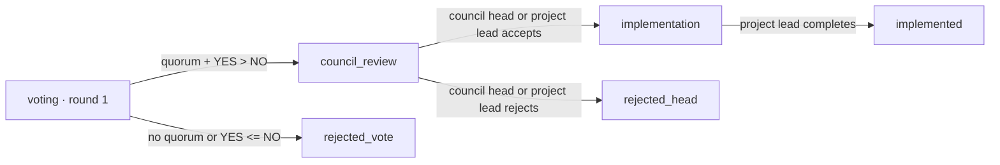

---
tags:
  - domain
  - governance
  - rbac
---

# General Council of Orion

`gso.php` is the public chamber and decision archive for the General Council of Orion (GSO).
Everyone may read it. Only accounts with `council.participate` can submit proposals or vote;
ordinary `player` accounts and anonymous visitors are read-only.

## Seats

`gso_eligible_members()` derives occupied seats from current staff accounts. The chamber always
renders a three-step leadership ladder: the project lead/creator first, developers second, and
the Orion council head third. A missing leadership role remains visible as an unassigned office.
Senior moderators, moderators, and content makers render in separate colour-coded role groups
below the ladder; each group remains visible when empty. There is no configured capacity and no
artificial vacant-seat padding: each current eligible account produces exactly one seat, so role
changes are reflected on the next request.

Every occupied seat has one vote. The member list is dynamic, while each proposal snapshots
`eligible_voters` and `quorum_required` when it is created.

## Decision workflow

The quorum is half the occupied seats rounded up, with a minimum of two whenever more than one
member exists. `yes`, `no`, and `abstain` all count toward quorum; only `yes > no` passes.
Voting closes when its deadline expires, when all snapshotted voters have voted, or when the
project lead/council head closes it early after quorum.

Review authority is identified by role, not by a permission override: `gso_can_decide_review()`
accepts the `orion_council_head` role and the `admin` role (project lead / site owner), so the
project lead can decide a passed vote himself when the council head seat is empty or silent. No
other role qualifies — the developer holds `council.review` in the panel but is rejected here.
`gso_decision_authority_label()` signs the event timeline with the deciding office ("Глава
проекта" or "Глава совета"), and the proposal card labels a stored note the same way.

Acceptance sends the decision to implementation. Rejection immediately and permanently moves it
to `rejected_head`; no second voting round opens. Accepted decisions enter the project lead's
`admin.php?tab=implement` queue, where they can be started, deferred, or completed with an
implementation report.

## Status override

No state is a dead end for the project lead. `gso_override_status()` (project-head only, action
`override_gso_status` on the implement tab) moves any proposal to any of the six workflow states
with a mandatory reason, which is written to `gso_events` as `status_override` and to
`staff_action_log` as `gso.status`. Each target repairs the fields that state implies:

- `voting` — increments `vote_round`, re-snapshots `eligible_voters`/`quorum_required` from the
  current seats and restarts the deadline from `voting_duration_days`; earlier rounds' ballots
  stay in `gso_votes` under their own round;
- `council_review` — clears the head decision so it can be taken again;
- `implementation` — reopens the queue entry; an existing `accept` decision keeps the council
  head's note, otherwise the project lead's reason is recorded as the acceptance;
- `implemented` — writes the reason as the implementation report;
- `rejected_vote` / `rejected_head` — close the proposal, the latter as a project-head rejection.

The implement tab therefore has two lists: the pending queue (`status = 'implementation'`) and
the archive of everything else, each row carrying the status form.

An override is **not published**. Its `gso_events` row is written with `visibility = 'internal'`,
and `gso_load_events()` filters those out unless called with `$include_internal = true` — which
only the admin panel does, rendering them under each row as "Служебная хронология". The override
also never writes `head_note` or `implementation_note`, because those two fields *are* rendered
publicly on the proposal card; the reason lives in the internal event and in `staff_action_log`.
Council-head and project-head decisions taken through the normal `head_decision` flow stay public
as before. Public visitors still see the resulting status — the state itself is public data, only
the actor and the reason are not.

Active proposals and history render as collapsed title-only lists. Opening a title reveals its
description, expected result, vote totals, available actions, head note, and event timeline.

## Tables

- `gso_proposals` — proposal text, legacy round/rejection fields, quorum snapshot, workflow state, head decision, implementation;
- `gso_votes` — one current choice per `(proposal_id, vote_round, account_id)`, retaining earlier-round ballots;
- `gso_events` — append-only timeline of proposal, voting, review, and implementation events;
  `visibility` is `public` (rendered on `gso.php`) or `internal` (admin panel only).

Mutating public forms use the site CSRF token. Staff-visible mutations are also written to
`staff_action_log`.

Related: [[Roles and permissions]], [[Admin panel]], [[Database schema]]
