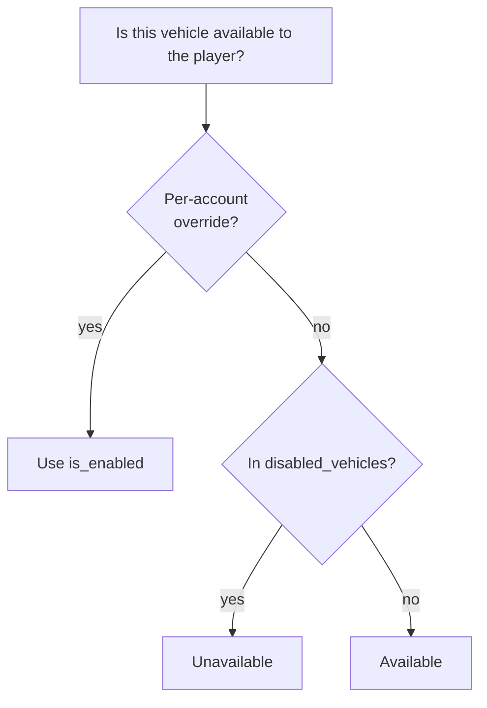

---
tags:
  - domain
  - game
---

# Vehicle access

The "vehicle control" tab in the admin panel governs which vehicles are available to players.

> [!warning] The 0.8.2 game server ignores these rules entirely
> Verified 2026-07-19: the newer 0.8.2 server (`wot_082` repo) reads only `accounts` and
> `vehicle_modules` — never `disabled_vehicles` or `account_vehicle_overrides`. It hands
> **every player the full 253-tank catalog** regardless of what this tab says.
>
> So the rules staff record here (329 override rows, 48 logged events at the time of
> writing) are enforced only by whichever server actually reads them — not by 0.8.2. The
> site side is fine; the gap is on the game side, and closing it means teaching the 0.8.2
> server to filter its catalog by these two tables. Until then, treat this tab as
> **advisory** for 0.8.2 players. See [[Database schema]] for the two-servers picture.

## The catalog is a file, not a table

`_vehicles.json` in the root (~800 KB) is the source of truth for vehicle names, nations and
tiers. The database stores **only access rules**; the catalog itself isn't in it.

`load_vehicle_catalog()` in `admin.php`:

- reads the JSON, takes `data['vehicles']`
- skips entries without a `name`
- assigns `inv_id` = index + 1
- computes `level_calculated` via `vehicle_level()`: the `level` field first, otherwise parsed
  from a `tierN` tag; the result is clamped to 1–10
- sorts by (nation, tier, name)

## Two layers of rules

**1. Global** — the `disabled_vehicles` table. A row present means the vehicle is disabled for
everyone. It's a blocklist: no row → available.

**2. Per-account** — `account_vehicle_overrides(account_id, vehicle_name, is_enabled)`.
Overrides the global rule for one player, in both directions: you can open something disabled
globally, or close something that's open.

**3. Journal** — `vehicle_access_events` records every change with `scope` (`global` / `account`),
`account_id`, vehicle name, new state and timestamp. This is vehicle-access history specifically,
separate from the general `staff_action_log` audit.

## Actions (all AJAX)

| Action | Effect |
|---|---|
| `set_global_vehicle` | one vehicle, globally |
| `bulk_global_vehicles` | many vehicles, globally |
| `set_account_vehicle` | one vehicle, one player |
| `bulk_account_vehicles` | many vehicles, one player |
| `reset_account_overrides` | drop all of a player's overrides |
| `enable_all_global` | clear `disabled_vehicles` |

Permission: `vehicles.manage`. Audit: `vehicle.global`, `vehicle.account`.

`normalize_vehicle_names()` filters incoming names against the set of real catalog names,
so nothing arbitrary from the form reaches the table.

## Client side

`js/admin.js`: `toggleGlobal()`, `setPlayerMode()`, `bulkGlobal()`, `bulkPlayer()`,
`resetOverrides()`, `enableAllGlobal()`. After the server responds, the table row pulses
(`pulseRow`) and the effective state is recomputed (`updateEffective`) — no page reload.

> [!note] Effective state
> The table shows the global rule, the per-account rule, **and** the result of combining them.
> `updateEffective()` computes that result client-side using the same logic as the server —
> if you change the combination rules, both places need updating.

Related: [[Admin panel]], [[Database schema]]
